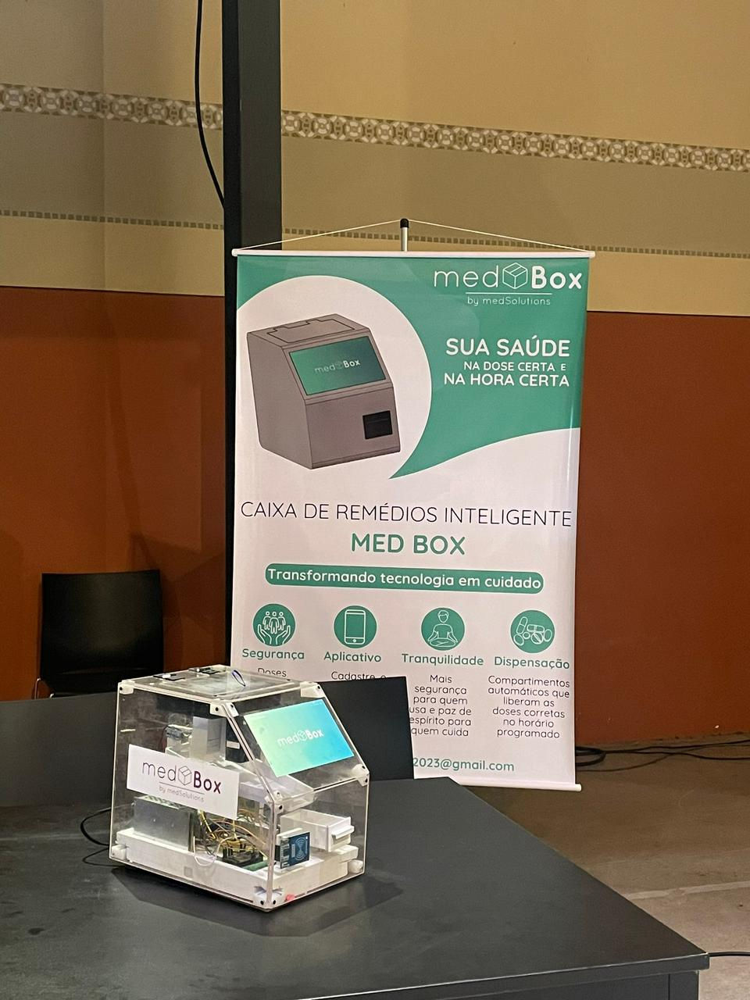
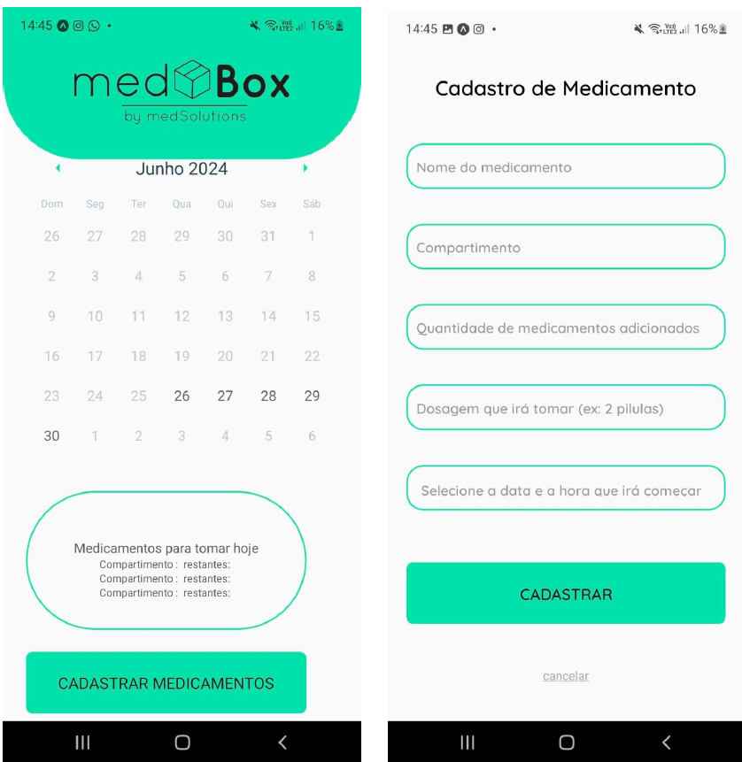
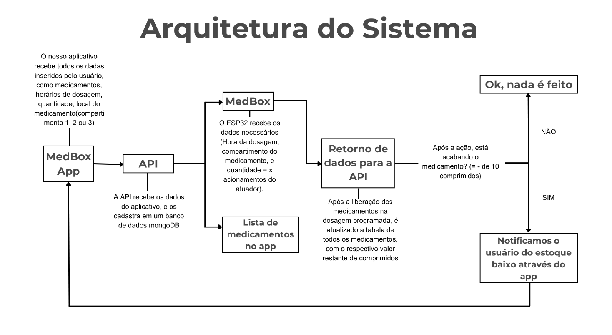

# 💊 MedBox - Smart Pillbox IoT

Projeto desenvolvido como Trabalho de Conclusão de Curso em Automação Industrial.

A **MedBox** é uma caixa de medicamentos inteligente baseada em IoT, criada para auxiliar usuários no gerenciamento de horários e dosagens de medicamentos, com foco principalmente em idosos e pessoas em tratamentos contínuos.

O sistema integra hardware, backend, banco de dados e aplicativo mobile para automatizar a administração de medicamentos de forma acessível, segura e intuitiva.

---

## 📸 Preview do Projeto

## Tecnologias Utilizadas

### 🔌 Hardware
• ESP32
• RFID RC522
• Módulo Relé
• Solenoides
• Buzzer
• Fonte DC

### 💻 Software
• C++
• Node.js
• Express.js
• MongoDB
• React Native

### 🛠️ Ferramentas
• VS Code
• Arduino IDE
• Git & GitHub
• Postman

### ⚙️ Funcionalidades
• Cadastro de medicamentos
• Controle de horários e dosagens
• Alertas sonoros
• Liberação automatizada de comprimidos
• Integração entre aplicativo e ESP32
• Comunicação via API REST
• Identificação por RFID
• Gerenciamento remoto de medicamentos

## 🧠 Arquitetura do Sistema

A MedBox funciona através da comunicação entre quatro principais componentes:

1. Aplicativo Mobile
2. API Backend (Node.js)
3. Banco de Dados MongoDB
4. ESP32 responsável pela automação física

O aplicativo envia os dados para a API, que armazena as informações no banco de dados e disponibiliza os comandos ao ESP32 para controle da dispensação dos medicamentos.

## 📱 Aplicativo Mobile

O aplicativo foi desenvolvido em React Native e permite:

• Cadastro de medicamentos
• Controle de horários
• Configuração de dosagens
• Gerenciamento dos medicamentos cadastrados

## 🔌 Hardware e Automação

O ESP32 é responsável por:

• Controlar os atuadores de liberação
• Acionar alertas sonoros
• Gerenciar leitura RFID
• Integrar a automação com a API

## 📂 Estrutura do Projeto

medbox-iot-smart-pillbox/
│
├── Códigos/
│   ├── esp32/
│   ├── API/
│
├── Mídias/
│
├── Docs/
│   └── Monografia Med Box
│
└── README.md

## 🧪 Conceitos Aplicados

Durante o desenvolvimento da MedBox, foram aplicados conhecimentos em:

• Internet das Coisas (IoT)
• Sistemas embarcados
• APIs REST
• Integração hardware/software
• Desenvolvimento mobile
• Banco de dados NoSQL
• Arquitetura de sistemas
• Automação industrial

## 📚 Documentação

A monografia completa do projeto está disponível na pasta:

/docs

## 🎯 Objetivo do Projeto

O principal objetivo da MedBox é aumentar a adesão a tratamentos medicamentosos através da automação e da tecnologia, reduzindo esquecimentos e facilitando o acompanhamento de medicamentos.

## 👨‍💻 Desenvolvido por

Bernardo Brito e
Equipe Med Solutions

GitHub: https://github.com/bernardobritto
LinkedIn: https://linkedin.com/in/bernardobritoo